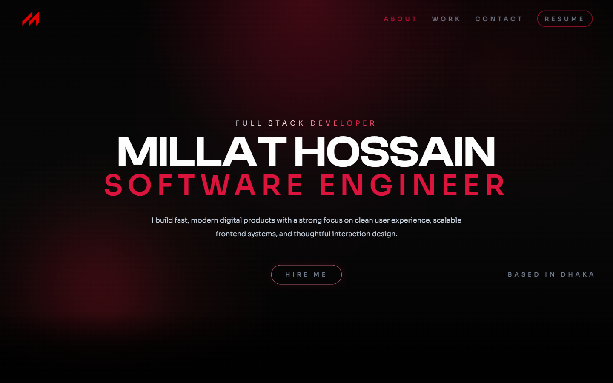
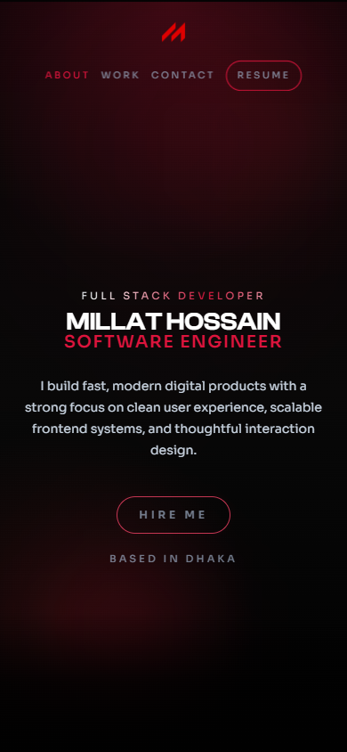
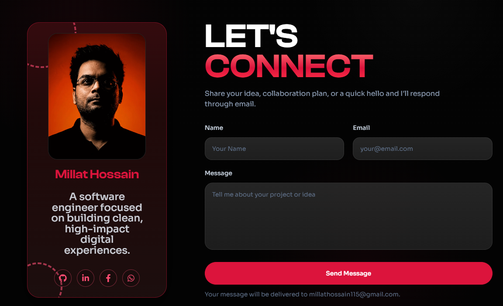

# Millat Hossain Portfolio

Modern portfolio website for Millat Hossain, built with Vite, React, Tailwind CSS, GSAP, and Lenis. The site presents profile details, education, experience, selected projects, skills, resume access, contact links, and production SEO metadata for deployment on Vercel.

**Live site:** [millathossain.vercel.app](https://millathossain.vercel.app/)

## Preview

| Desktop | Mobile |
| --- | --- |
|  |  |

## Contact Section



## Highlights

- Responsive single-page portfolio with smooth section navigation.
- Animated intro, scroll-triggered section reveals, and horizontal project rail.
- Project data split between live projects and architecture/product concept studies.
- Education, experience, skills, resume, social links, and contact form sections.
- Public SEO configuration through `VITE_*` environment variables.
- Static `robots.txt`, `sitemap.xml`, Open Graph image, canonical URL, and JSON-LD checks.
- Production build automatically runs the SEO validation script.

## Tech Stack

- **Framework:** React 19 + Vite
- **Styling:** Tailwind CSS 4
- **Animation:** GSAP ScrollTrigger + Lenis smooth scrolling
- **Icons:** React Icons
- **Quality:** ESLint, Prettier, custom SEO validation
- **Deployment:** Vercel

## Getting Started

### Prerequisites

- Node.js and npm
- Git

### Installation

```bash
npm install
```

Create a local environment file:

```bash
cp .env.example .env.local
```

Update `.env.local` with the public profile, SEO, and social values you want to use locally.

### Development

```bash
npm run dev
```

The dev server is configured in [vite.config.js](vite.config.js) to run on port `5173`.

### Production Build

```bash
npm run build
```

The build command runs Vite first, then validates production SEO output with [scripts/check-seo.mjs](scripts/check-seo.mjs).

## Available Scripts

| Command | Purpose |
| --- | --- |
| `npm run dev` | Start the local Vite dev server. |
| `npm run build` | Build the production bundle and run SEO validation. |
| `npm run preview` | Preview the production build locally. |
| `npm run check:seo` | Validate generated SEO files in `dist`. |
| `npm run lint` | Run ESLint across the project. |
| `npm run format` | Format files with Prettier. |
| `npm run format:check` | Check formatting without writing changes. |

## Environment Variables

All client-exposed values must use the `VITE_` prefix because this is a Vite app.

| Variable | Description |
| --- | --- |
| `VITE_APP_NAME` | Public app/site name. |
| `VITE_SITE_TITLE` | Browser and SEO title. |
| `VITE_SITE_DESCRIPTION` | Meta description and social summary. |
| `VITE_SITE_URL` | Canonical production URL. |
| `VITE_OG_IMAGE` | Absolute Open Graph image URL. |
| `VITE_PROFILE_IMAGE` | Absolute public profile image URL. |
| `VITE_CONTACT_EMAIL` | Public contact email used in metadata. |
| `VITE_GITHUB_URL` | GitHub profile URL. |
| `VITE_LINKEDIN_URL` | LinkedIn profile URL. |
| `VITE_FACEBOOK_URL` | Facebook profile URL. |
| `VITE_GOOGLE_SITE_VERIFICATION` | Google Search Console HTML-tag token. |

Use [.env.example](.env.example) as the source template. Do not commit `.env.local`.

## Project Structure

```text
.
├── public/                 # Favicon, social image, robots.txt, sitemap.xml
├── scripts/                # Production SEO validation
├── src/
│   ├── assets/             # Images, resume, and project media
│   ├── components/         # Navbar, footer, loader, shared UI
│   ├── constants/          # Projects, skills, education, experience data
│   ├── hooks/              # Shared viewport/interaction hooks
│   └── sections/           # Page sections for the portfolio
├── docs/screenshots/       # README screenshots
└── vite.config.js
```

## Content Updates

- Update projects, skills, education, and experience in [src/constants/index.js](src/constants/index.js).
- Update contact and social links in [src/sections/Contact/contactLinks.js](src/sections/Contact/contactLinks.js).
- Replace resume PDF in [src/assets/Resume](src/assets/Resume).
- Replace public SEO images in [public](public), keeping `og-image.png` at `1200x630`.
- Keep canonical URLs aligned between `.env.production`, `public/robots.txt`, `public/sitemap.xml`, and `scripts/check-seo.mjs`.

## SEO Checklist

Before deployment, run:

```bash
npm run build
```

The SEO validator checks for:

- canonical homepage URL
- Open Graph URL
- ProfilePage and Person JSON-LD
- public contact identity
- sitemap reference in `robots.txt`
- sitemap canonical URL
- valid Open Graph image dimensions
- missing placeholder or localhost URLs

## Deployment

Recommended Vercel settings:

| Setting | Value |
| --- | --- |
| Framework preset | Vite |
| Build command | `npm run build` |
| Output directory | `dist` |
| Environment variables | Add the same public `VITE_*` values from `.env.example`. |

After the first production deploy, create a Google Search Console URL-prefix property for `https://millathossain.vercel.app/`, add the HTML-tag token to `VITE_GOOGLE_SITE_VERIFICATION`, redeploy, verify ownership, and submit `sitemap.xml`.

## GitHub Push Checklist

1. Confirm generated and local-only files are ignored: `node_modules`, `dist`, `.env.local`, and `.vercel`.
2. Run `npm run lint` and `npm run build`.
3. Commit the project.
4. Push to the default branch.
5. Import or redeploy the repository in Vercel.
